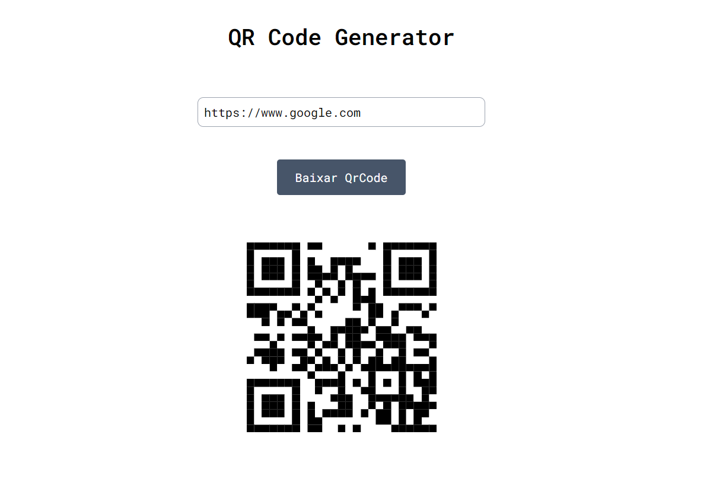

# QR Code Generator
Aplicação para gerar QR Codes  

<https://main--chipper-moonbeam-93cf02.netlify.app/>

## Tecnologias

Esse projeto foi desenvolvido com as seguintes tecnologias:

- React JS
- Tailwind CSS
- JavaScript  

## Run Locally

~~~bash
$ npm run dev
~~~

